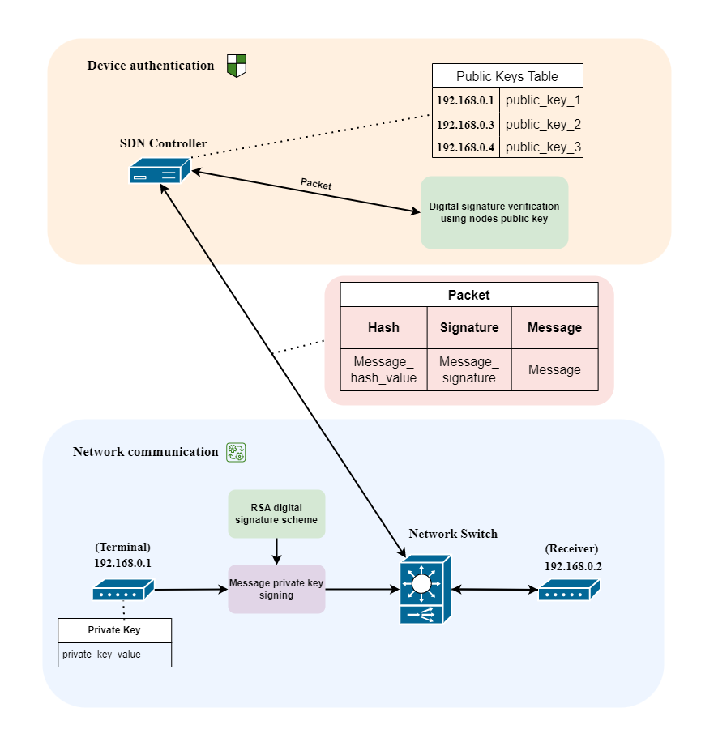

# Device authentication
RSA digital signature scheme

## Topology

  

## `Output`
<code>  
0: 192.168.0.2 received packet: U dun say so early hor... U c already then say...  
0: Packet forwarded. 
1: 192.168.0.2 received packet: Nah I dont think he goes to usf, he lives around here though 
1: Packet forwarded. 
2: 192.168.0.2 received packet: Nah I dont think he goes to usf, he lives around here though 
2: Packet forwarded. 
3: Invalid signature from 192.168.0.3, packet dropped. 
4: 192.168.0.2 received packet: Ok lar... Joking wif u oni... 
4: Packet forwarded. 
5: Malicious packet from 192.168.0.3 dropped. 
5: Sender 192.168.0.3 appended on blacklist 
6: Untrusted sender 192.168.0.3 tried to communicate with 192.168.0.2. Packet dropped. 
7: Malicious packet from 192.168.0.1 dropped. 
7: Sender 192.168.0.1 appended on blacklist 
8: Untrusted sender 192.168.0.3 tried to communicate with 192.168.0.2. Packet dropped. 
9: Untrusted sender 192.168.0.3 tried to communicate with 192.168.0.2. Packet dropped.
10: 192.168.0.2 received packet: U dun say so early hor... U c already then say... 
10: Packet forwarded. 
11: Untrusted sender 192.168.0.1 tried to communicate with 192.168.0.2. Packet dropped. 
12: Untrusted sender 192.168.0.1 tried to communicate with 192.168.0.2. Packet dropped. 
13: Untrusted sender 192.168.0.1 tried to communicate with 192.168.0.2. Packet dropped. 
14: 192.168.0.2 received packet: Nah I dont think he goes to usf, he lives around here though 
14: Packet forwarded. 
15: Untrusted sender 192.168.0.1 tried to communicate with 192.168.0.2. Packet dropped. 
16: Untrusted sender 192.168.0.1 tried to communicate with 192.168.0.2. Packet dropped. 
<strong>17: Invalid signature from 192.168.0.4, packet dropped.</strong> 
18: 192.168.0.2 received packet: U dun say so early hor... U c already then say... 
18: Packet forwarded. 
19: 192.168.0.2 received packet: U dun say so early hor... U c already then say... 
19: Packet forwarded. 
</code>

### In packet message 17 the message was tempered
